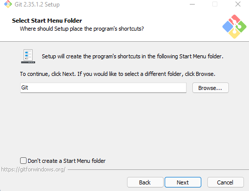
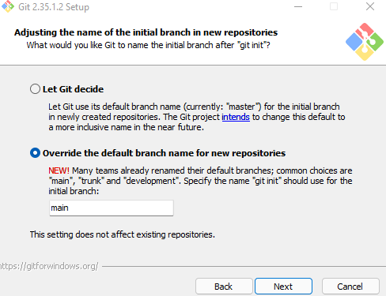
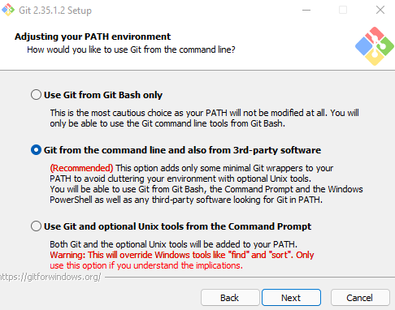

#PRAKTIKUM TEKNOLOGI CLOUD

### Nama: NURUL HALIMAH

### NIM: 215611106

### Prodi: Sistem Informasi

##A. Instalasi GIT di Windows

1. Setelah selesai download Git, jalankan program GIT. Akan dimunculkan lisensi. Klik Next untuk lanjut.


2. Setelah itu, pilih lokasi instalasi. Secara default akan terisi C:\Program Files\Git. Ganti lokasi jika memang anda menginginkan lokasi lain. Klik Next untuk lanjut.


3. Pilih komponen. Tidak perlu diubah-ubah, sesuai dengan default saja. Klik pada Next.


4. Mengisi shortcut untuk menu Start. Gunakan default (Git), ganti jika ingin mengganti - misalnya Git VCS.



5. Pilih editor yang akan digunakan bersama dengan Git. Pada pilihan ini, digunakan Visual Studio Code.


6. Pada saat instalasi, kita bisa melakukan setting default branch saat melakukan git init, disini saya memilih main



7. Pada saat instalasi, Git menyediakan akses git melalui Bash maupun command prompt. Pilih pilihan kedua supaya bisa menggunakan dari dua antarmuka tersebut. Bash adalah shell di Linux. Dengan menggunakan bash di Windows, pekerjaan di command line Windows bisa dilakukan menggunakan bash - termasuk ekskusi dari Git.



8. Pilih bundled OpenSSH untuk HTTPS. Git menggunakan SSH untuk akes ke repo GitHub atau repo-repo lain (GitLab, Assembla).


##B. Konfigurasi GIT
Untuk melakukan konfigurasi GIT bisa melakukan melalui Command prompt dengan memakai perintah sebagai berikut.
Konfigurasi Username dan Email Isian di bawah harus disesuaikan dengan nama serta email yang digunakan untuk mendaftar di GitHub.

1. Konfigurasi Username dan Email Isian di bawah harus disesuaikan dengan nama serta email yang digunakan untuk mendaftar di GitHub.

```sh
$ git config --global user.name "Nama Anda di GitHub"
$ git config --global user.email email@domain.tld
```

2. untuk melihat hasil konfigurasi dengan perintah

```sh
$ git config --list
```

untuk hasilnya seperti ini


##C. Mengelola Repo Sendiri di Account Sendiri

Untuk membuat repo, gunakan langkah-langkan berikut:

1. Klik tanda + pada bagian atas setelah login, pilih New repository
   

2. Isikan nama, keterangan, serta lisensi. Jika dikehendaki, bisa membuat repo Private
   

##D. Mengelola Repo Sendiri di Organisasi
Untuk membuat repo, gunakan langkah-langkan berikut:

1. Masuk pada Organisasi Kalian lalu Klik tanda + pada bagian atas setelah login, pilih New repository


2. Isikan nama, keterangan, serta lisensi. Jika dikehendaki, bisa membuat repo Private


