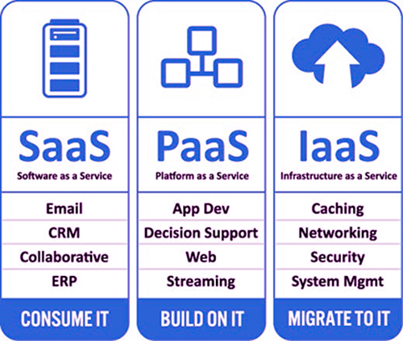

_215611106_ Nurul Halimah

## A. Perbedaan Antara IaaS, SaaS, dan PaaS

1. IaaS adalah Infrastruktur sebagai Layanan
   Ini menyediakan lingkungan bagi pengembang untuk membangun aplikasi yang dapat digunakan pengguna. Pengguna membuat mesin virtual (VM) sesuai permintaan.
   Dari perpustakaan gambar VM.
   Amazon (AWS) adalah vendor terkemuka dalam menyediakan IaaS.

2. SaaS adalah Perangkat Lunak sebagai Layanan
   Ini berarti menjalankan aplikasi di cloud publik. Pengguna menggunakan aplikasi ini melalui Internet. Aplikasi ini dikelola oleh Penyedia Layanan. Beberapa mis., Penyedia Layanan, adalah SalesForce, Microsoft (Office 365), Oracle, Google (Google Apps), dll.
3. PaaS adalah Platform sebagai Layanan Pengembang menyediakan aplikasi yang dijalankan oleh platform.
   Mereka tidak secara langsung membuat VM.
   Anda akan berpikir bahwa PaaS sederhana dan itulah sebabnya banyak digunakan. Tapi ini tidak benar. IaaS 10 kali lebih populer dari PaaS. Pengembang ingin memiliki kontrol lebih besar atas sumber daya.

_tabel perbedaan antara IaaS, SaaS, dan PaaS_

## B. Arsitektur SaaS

Dengan model ini, satu versi aplikasi, dengan konfigurasi tunggal digunakan untuk semua pelanggan. Aplikasi diinstal pada beberapa mesin untuk mendukung skalabilitas (disebut penskalaan horizontal). Dalam beberapa kasus, versi kedua dari aplikasi diatur untuk menawarkan sekelompok pelanggan tertentu dengan akses ke versi pra-rilis aplikasi untuk tujuan pengujian. Dalam model tradisional ini, setiap versi aplikasi didasarkan pada kode unik. Meskipun pengecualian , beberapa solusi SaaS tidak menggunakan multitenancy, untuk mengelola sejumlah besar pelanggan dengan biaya yang efektif. Apakah multitenancy merupakan komponen yang diperlukan untuk software-as-a-service adalah topik kontroversi.

Ada dua jenis utama SaaS:

- SaaS Vertikal
  Perangkat Lunak yang menjawab kebutuhan industri tertentu (misalnya, perangkat lunak untuk perawatan kesehatan, pertanian, real estat, industri keuangan)
- SaaS Horisontal
  Produk yang berfokus pada kategori perangkat lunak (pemasaran, penjualan, alat pengembang, SDM) tetapi agnostik industri.

## C. Perangkat Lunak sebagai Arsitektur Platform SaaS Layanan

SaaS adalah cara untuk memberikan perangkat lunak, penyedia perangkat lunak secara terpusat menghosting satu atau lebih aplikasi dan membuatnya tersedia untuk pelanggan melalui internet.

SaaS juga merupakan salah satu pilar utama komputasi awan. Ledakan dalam komputasi Cloud, didorong oleh penyedia layanan cloud seperti Microsoft dengan Azure, Amazon Web Services (AWS), Oracle, dan IBM, telah melihat pertumbuhan produk dan layanan lain yang dikirimkan melalui internet termasuk model SaaS berikut:

- Infrastruktur sebagai Layanan
- Platform sebagai Layanan
- Pembelajaran Mesin sebagai Layanan

Setiap pembaruan ke aplikasi SaaS semuanya ditangani oleh penyedia. Pelanggan tidak perlu mengunduh pemutakhiran atau menginstal ulang versi baru produk karena perangkat lunak dikirimkan melalui internet. Ini beroperasi sebagai arsitektur SaaS multi-penyewa di mana semua database dan template yang relevan dengan pengguna berlisensi dapat diakses terlepas dari lokasi.

Dengan penjelasan tentang metodologi SaaS dan perusahaan SaaS, mari kita lihat mengapa Anda mungkin ingin menggunakan produk perangkat lunak yang dirancang seperti ini.

## D. Cara Membuat Aplikasi SaaS dengan Menggunakan Cloud

Untuk membuat aplikasi SaaS membangunnya menggunakan cloud. Dalam Cloud memiliki banyak keuntungan skalabilitas berbeda dengan menggunakan lingkungan server lokal. Saat membangun produk untuk cloud berarti membangun produk dengan bahasa pemrograman modern. Selain kemampuan dan keterampilan, pilihan bahasa pemrograman juga penting. Dalam hal ini bisa menggunakan bahasa pemrograman Python. Python adalah bahasa pemrograman yang banyak digunakan, yang dirancang untuk menekankan pada keterbacaan kodenya. Python sangat bagus dan banyak pengembang menyukainya. Pengetikan dinamis, pemrograman meta, prototyping cepat. Selain itu Python termasuk dalam bahasa pemrograman yang aman. Selain bahasa pemrograman, penggunaan database juga sangat penting dalam hal ini disarankan menggunakan database dengan berorientasi dokumen. Database dokumen mendapatkan informasi jenisnya dari data itu sendiri. Dengan demikian setiap contoh data dapat berbeda dari yang lain. Hal ini memungkinkan lebih banyak fleksibilitas, terutama ketika berhadapan dengan perubahan. Dan itu sering mengurangi ukuran database atau konsep DOB menawarkan pengalaman yang lebih banyak dengan teknik pemrograman modern. Dalam hal ini bisa menggunakan MongoDB. MongoDB adalah database berorientasi dokumen yang memberikan kinerja tinggi, ketersediaan tinggi, dan skalabilitas yang mudah.
