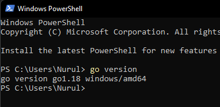
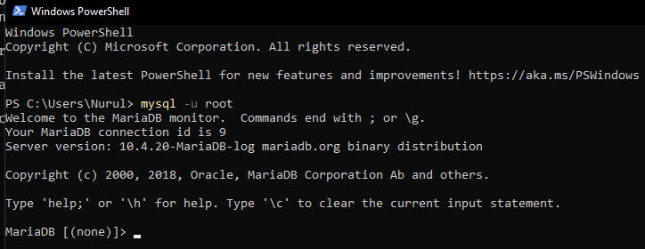

## _215611106 - Nurul Halimah_

## Install GO

1. [Download Go](https://go.dev/dl/) sesuai OS yang digunakan
2. Setelah selesai download, kita install Go
3. setelah berhasil install go, kita bisa mengeceknya menggunakan terminal

## Install MYSQL

1. [Download MYSQL](https://dev.mysql.com/downloads/installer/) sesuai OS yang digunakan
2. Setelah selesai download, kita install MYSQL
3. setelah berhasil install MYSQL, kita bisa mengeceknya menggunakan terminal

## Install MONGODB

1. [Download MONGODB](https://www.mongodb.com/try/download/community) sesuai OS yang digunakan
2. Setelah selesai download, kita install MONGODB
3. setelah berhasil install MONGODB, kita bisa mengeceknya menggunakan terminal
