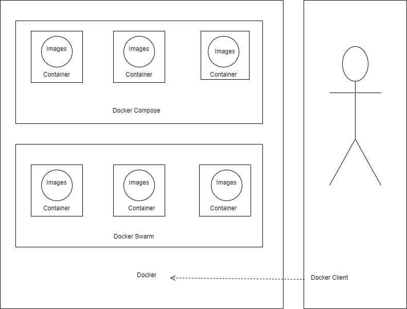

## _215611106 Nurul Halimah_

## Diagram

Dalam diagram ini bisa sedikit saya jelaskan :

1. docker images dijalankan pada docker container
2. dalam docker terdapat container manajemen yaitu docker compose dan docker swarm
3. untuk mengakses docker menggunakan docker client biasane menggunakan CLI atau docker dekstop untuk windows
