## _215611106 - Nurul Halimah_

# Application Containerization and Microservice Orchestration

## Stage Setup

1. git clone https://github.com/ibnesayeed/linkextractor.git
2. cd linkextractor
3. git checkout demo

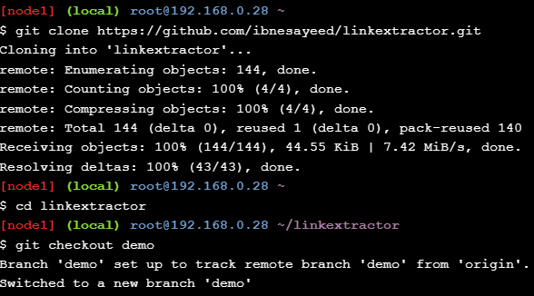

## Step 0: Basic Link Extractor Script

1. git checkout step0
2. tree
3. cat linkextractor.py
4. ./linkextractor.py http://example.com/
5. ls -l linkextractor.py
6. python3 linkextractor.py

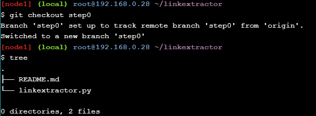

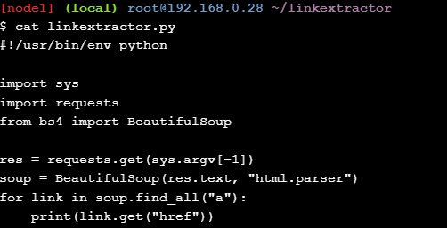

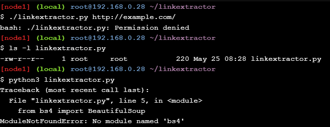

## Step 1: Containerized Link Extractor Script

1. git checkout step1
2. tree
3. cat Dockerfile
4. docker image build -t linkextractor:step1 .
5. docker image ls
6. docker container run -it --rm linkextractor:step1 http://example.com/
7. docker container run -it --rm linkextractor:step1 https://training.play-with-docker.com/

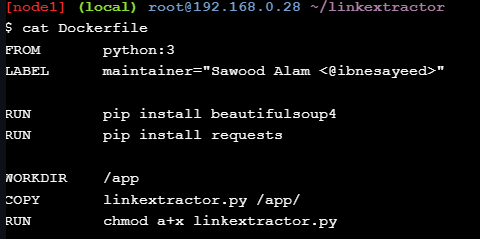

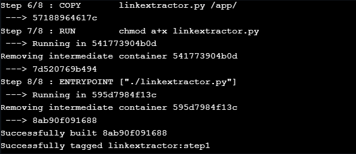

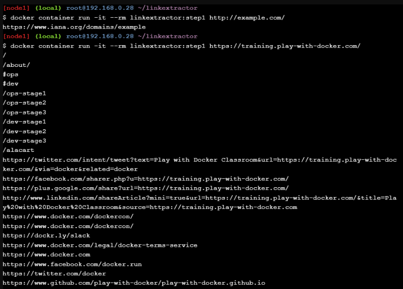

## Step 2: Link Extractor Module with Full URI and Anchor Text

1. git checkout step2
2. tree
3. cat linkextractor.py
4. docker image build -t linkextractor:step2 .
5. docker image ls
6. docker container run -it --rm linkextractor:step2 https://training.play-with-docker.com/

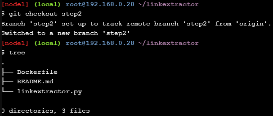

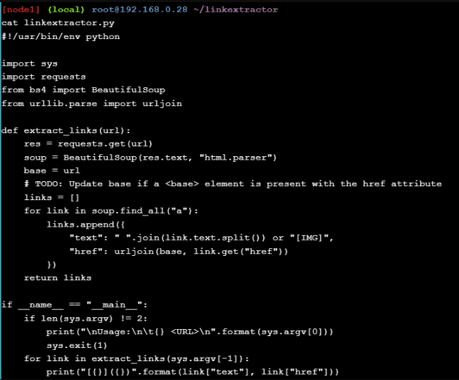

## Step 3: Link Extractor API Service

1. git checkout step3
2. tree
3. cat Dockerfile
4. cat main.py
5. docker image build -t linkextractor:step3 .
6. docker container run -d -p 5000:5000 --name=linkextractor linkextractor:step3
7. docker container ls
8. curl -i http://localhost:5000/api/http://example.com/
9. docker container logs linkextractor
10. docker container rm -f linkextractor

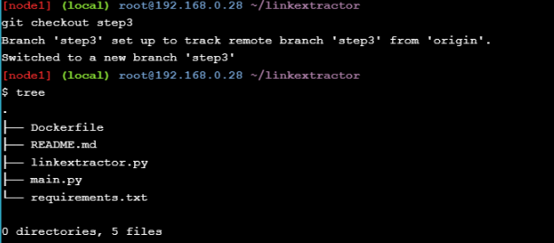

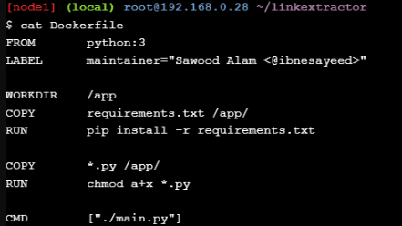

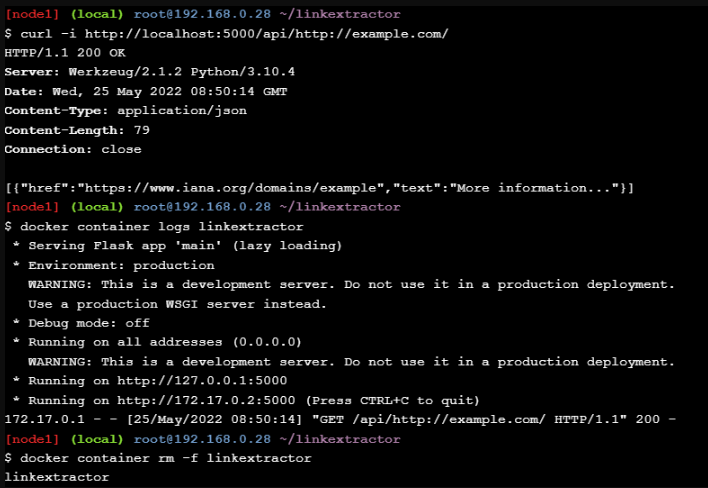

## Step 4: Link Extractor API and Web Front End Services

1. git checkout step4
2. tree
3. cat docker-compose.yml
4. cat www/index.php
5. docker-compose up -d --build
6. docker container ls
7. curl -i http://localhost:5000/api/http://example.com/
8. sed -i 's/Link Extractor/Super Link Extractor/g' www/index.php
9. git reset --hard
10. docker-compose down

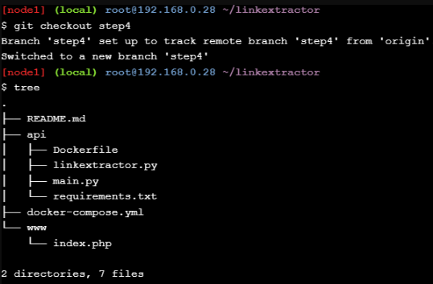

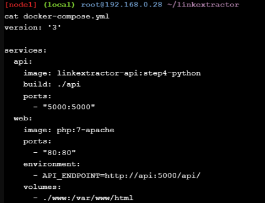

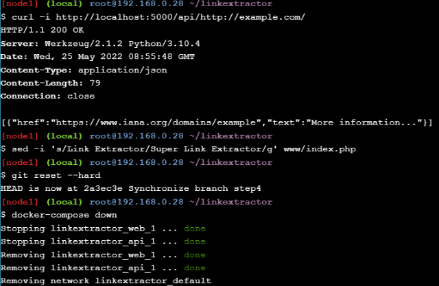

## Step 5: Redis Service for Caching

1. git checkout step5
2. tree
3. cat www/Dockerfile
4. cat api/main.py
5. cat docker-compose.yml
6. docker-compose up -d --build
7. docker-compose exec redis redis-cli monitor
8. sed -i 's/Link Extractor/Super Link Extractor/g' www/index.php
9. git reset --hard
10. docker-compose down

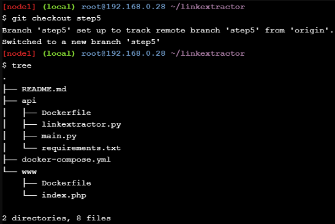

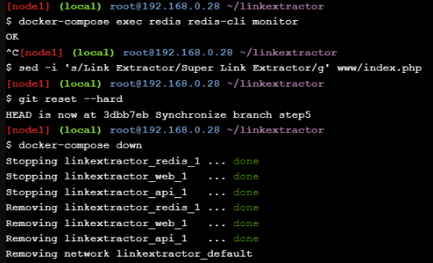

## Step 6: Swap Python API Service with Ruby

1. git checkout step6
2. tree
3. cat api/linkextractor.rb
4. cat api/Dockerfile
5. cat docker-compose.yml
6. docker-compose up -d --build
7. curl -i http://localhost:4567/api/http://example.com/
8. docker-compose down
9. cat logs/extraction.log

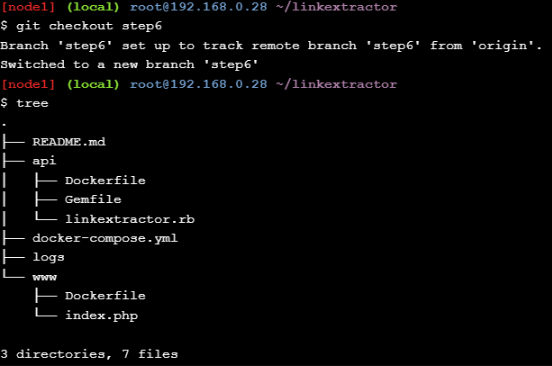

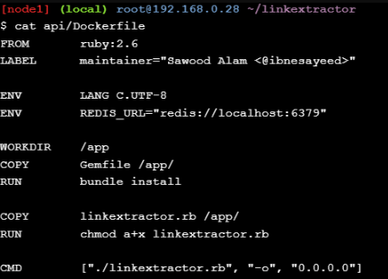

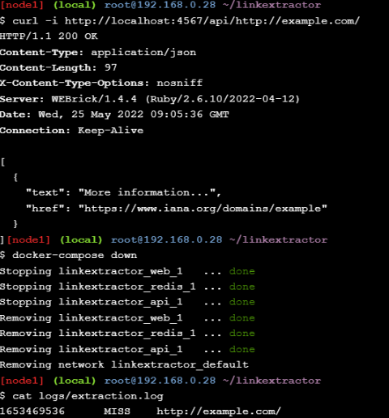
