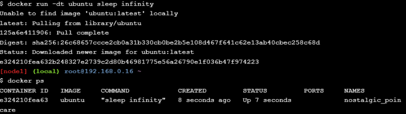
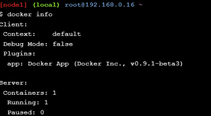
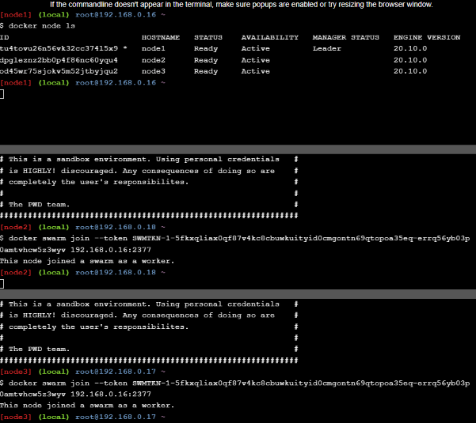
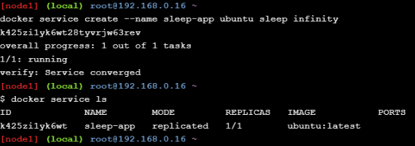
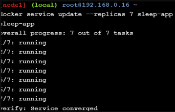
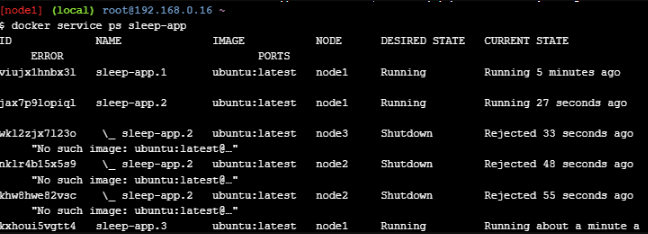
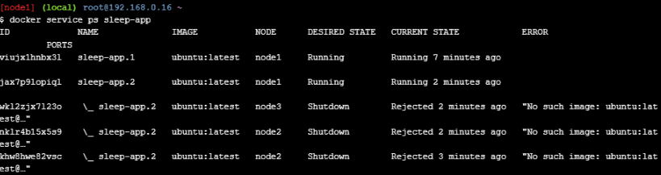
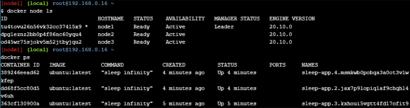
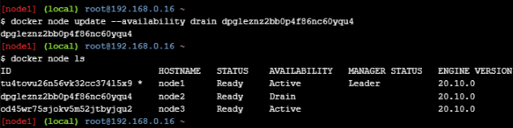
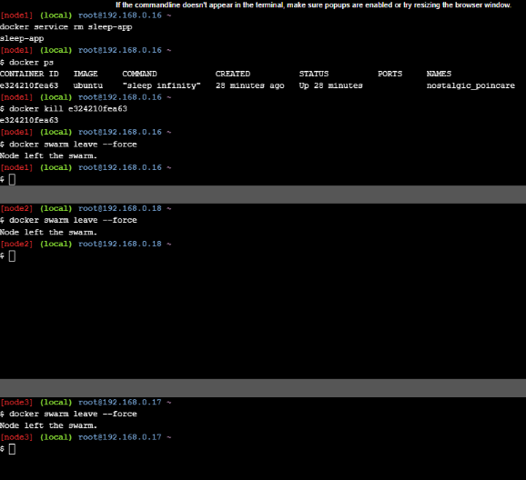

## _215611106 - Nurul Halimah_

# Docker Orchestration Hands-on Lab

## Section 2: Configure Swarm Mode

1. `docker run -dt ubuntu sleep infinity` jalankan perintah pada node 1
2. `docker ps` jalankan perintah pada node 1

## Step 2.1 - Create a Manager node

1. Jalankan pada node 1 `docker swarm init --advertise-addr $(hostname -i)` Setelah menjalankan perintah ini akan mendapatkan token seperti ini `docker swarm join --token SWMTKN-1-5fkxqliax0qf87v4kc8cbuwkuityid0cmgontn69qtopoa35eq-errq56yb03p0amtvhcw5z3wyv 192.168.0.16:2377`
2. Jalankan pada node 1 `docker info`

## Step 2.2 - Join Worker nodes to the Swarm

Token docker yang didapat dari node 1
`docker swarm join --token SWMTKN-1-5fkxqliax0qf87v4kc8cbuwkuityid0cmgontn69qtopoa35eq-errq56yb03p0amtvhcw5z3wyv 192.168.0.16:2377`

1. Jalankan perintah token docker ke node 2 dan 3
2. Lalu jalankan `docker node ls` pada node 1

# Section 3: Deploy applications across multiple hosts

## Step 3.1 - Deploy the application components as Docker services

1. Jalankan pada node 1 `docker service create --name sleep-app ubuntu sleep infinity`
2. Jalankan pada node 1 `docker service ls`

## Section 4: Scale the application

1. Jalankan pada node 1 `docker service update --replicas 7 sleep-app`
2. Jalankan pada node 1 `docker service ps sleep-app`
3. Jalankan pada node 1 `docker service update --replicas 4 sleep-app`
4. Jalankan pada node 1 `docker service ps sleep-app`

## Section 5: Drain a node and reschedule the containers

1. Jalankan pada node 1 `docker node ls`
2. Jalankan pada node 1 `docker node update --availability drain yournodeid`
3. Jalankan pada node 1 `docker node ls`
4. Jalankan pada node 1 `docker service ps sleep-app`

## Cleaning Up

1. Jalankan pada node 1 `docker service rm sleep-app`
2. Jalankan pada node 1 `docker ps`
3. Jalankan pada node 1 `docker kill yourcontainerid`
4. Jalankan pada node 1 `docker swarm leave --force`
5. Jalankan pada node 2 `docker swarm leave --force`
6. Jalankan pada node 3 `docker swarm leave --force`

